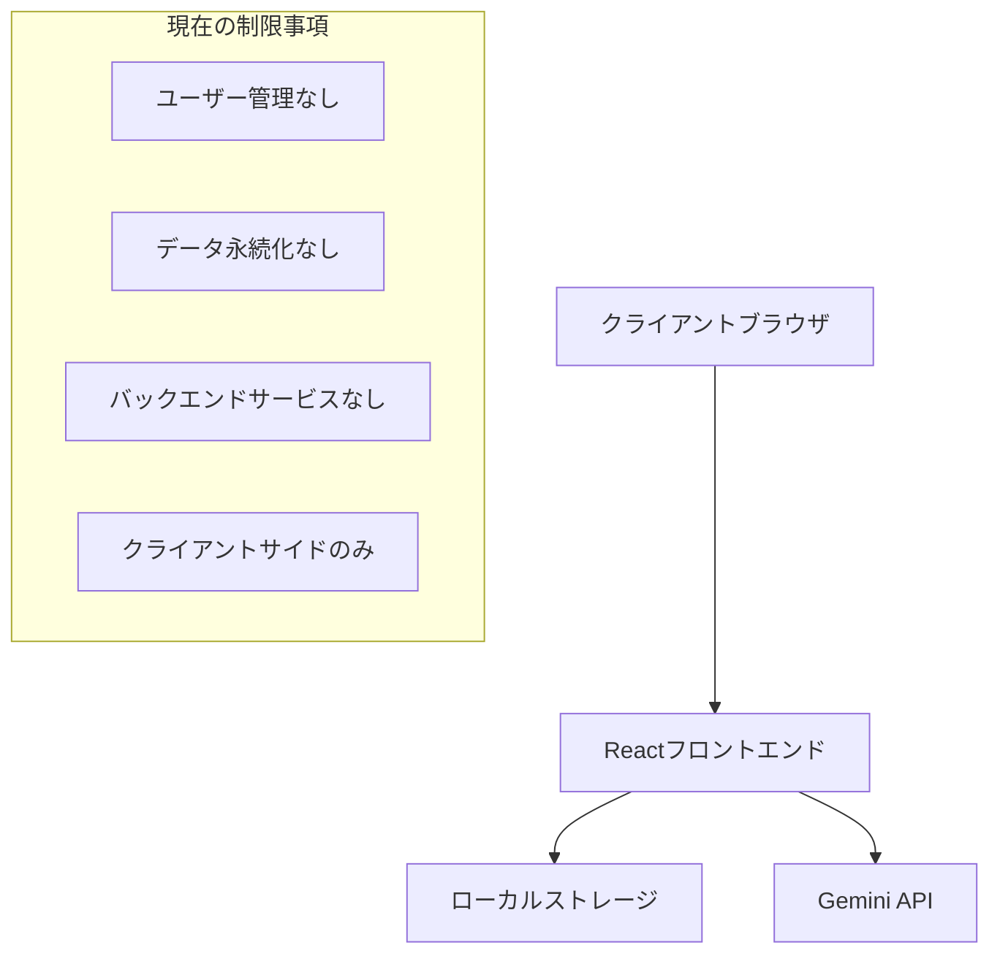
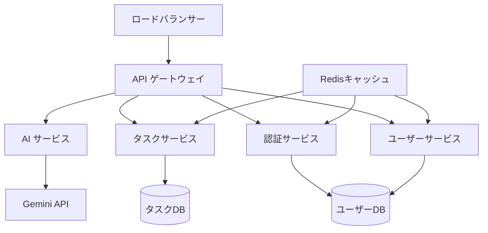
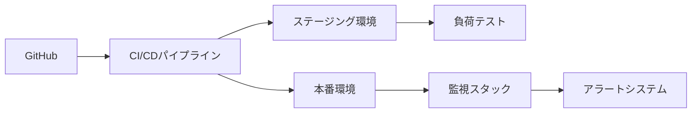
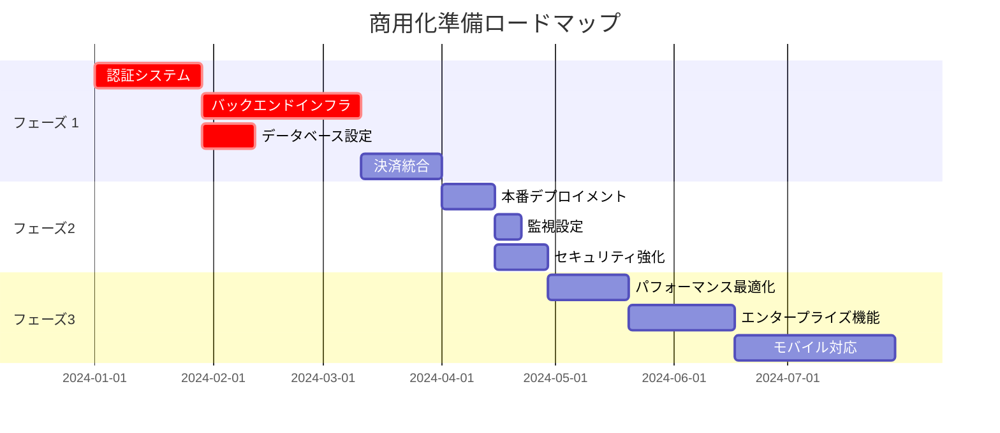

# 商用化準備状況評価: AI 搭載 TODO アプリ

## 概要

本文書は、現在の AI 搭載 TODO アプリケーション（ガントチャート機能付き）を分析し、商用化可能な有料サービスに変換するために必要な重要な改善点を特定します。評価対象は技術アーキテクチャ、ユーザーエクスペリエンス、セキュリティ、スケーラビリティ、ビジネス要件です。

## 現在のアーキテクチャ分析

### 技術スタック評価

- **フロントエンド**: React 19 + TypeScript + Vite (✓ モダン)
- **状態管理**: ローカル React 状態 + localStorage (⚠️ 制限あり)
- **AI 統合**: Google Gemini API (✓ 良好)
- **データストレージ**: ブラウザ localStorage のみ (❌ 重要な課題)
- **認証**: なし (❌ 重要な課題)
- **バックエンド**: なし (❌ 重要な課題)

## 重要な改善領域

### 1. 認証・ユーザー管理システム

**優先度: 重要 (P0)**
**作業量: 大**
**タイムライン: 4-6 週間**

#### 現在の制限事項

- ユーザーアカウントや認証なし
- ユーザーデータの分離なし
- サブスクリプション管理なし
- アクセス制御なし

#### 実装が必要なコンポーネント

| コンポーネント   | 説明                                    | 推奨技術                         |
| ---------------- | --------------------------------------- | -------------------------------- |
| 認証サービス     | リフレッシュトークン付き JWT ベース認証 | Auth0 / Firebase Auth / Supabase |
| ユーザー登録     | メール/パスワード + OAuth プロバイダー  | Auth0 Universal Login            |
| プロフィール管理 | ユーザー設定と好み                      | カスタムバックエンド API         |
| セッション管理   | 安全なセッション処理                    | JWT + Redis                      |

#### ビジネスへの影響

- **収益**: サブスクリプション課金を可能にする
- **データセキュリティ**: ユーザーデータの分離
- **コンプライアンス**: GDPR/プライバシー要件

### 2. バックエンドインフラストラクチャ・データ永続化

**優先度: 重要 (P0)**
**作業量: 大**
**タイムライン: 6-8 週間**

#### 現在の制限事項

- 全データがブラウザ localStorage に保存
- データバックアップや復旧なし
- クロスデバイス同期なし
- コラボレーション機能なし

#### 必要なバックエンドサービス

| サービス           | 機能                               | 技術スタック                   |
| ------------------ | ---------------------------------- | ------------------------------ |
| API ゲートウェイ   | リクエストルーティング、レート制限 | Kong / AWS API Gateway         |
| タスク管理 API     | タスクの CRUD 操作                 | Node.js + Express / NestJS     |
| ユーザー管理 API   | プロフィールと設定                 | 同じバックエンドフレームワーク |
| データベース層     | 永続的データストレージ             | PostgreSQL + Prisma ORM        |
| キャッシュ層       | パフォーマンス最適化               | Redis                          |
| ファイルストレージ | 添付ファイルとエクスポート         | AWS S3 / Cloudflare R2         |

### 3. サブスクリプション・決済システム

**優先度: 高 (P1)**
**作業量: 中**
**タイムライン: 3-4 週間**

#### 必要な機能

- **サブスクリプション階層**: 無料、プロ、エンタープライズ
- **決済処理**: Stripe 統合
- **使用量追跡**: API 呼び出し、ストレージ制限
- **請求管理**: 請求書、支払い方法

#### サブスクリプションモデル推奨案

| 階層             | 価格      | AI 要求/月 | プロジェクト | チームメンバー |
| ---------------- | --------- | ---------- | ------------ | -------------- |
| 無料             | ¥0        | 50         | 3            | 1              |
| プロ             | ¥990/月   | 1000       | 無制限       | 5              |
| エンタープライズ | ¥2,990/月 | 5000       | 無制限       | 20             |

### 4. 本番インフラストラクチャ・DevOps

**優先度: 高 (P1)**
**作業量: 中**
**タイムライン: 2-3 週間**

#### 現在の課題

- デプロイメントパイプラインなし
- 監視・ログなし
- エラー追跡なし
- パフォーマンスメトリクスなし

#### 必要なインフラストラクチャ

| コンポーネント               | 目的                       | 技術                       |
| ---------------------------- | -------------------------- | -------------------------- |
| CI/CD パイプライン           | 自動デプロイメント         | GitHub Actions / GitLab CI |
| コンテナオーケストレーション | スケーラブルデプロイメント | Docker + Kubernetes        |
| 監視                         | システムヘルス追跡         | Datadog / New Relic        |
| エラー追跡                   | バグ特定                   | Sentry                     |
| ログ管理                     | 集約ログ                   | ELK スタック / Datadog     |

### 5. 強化されたセキュリティフレームワーク

**優先度: 高 (P1)**
**作業量: 中**
**タイムライン: 2-3 週間**

#### 現在のセキュリティ対策

- ✅ API キー検証
- ✅ 入力サニタイゼーション
- ✅ XSS 保護

#### 追加要件

| セキュリティ層 | 実装                           | 優先度 |
| -------------- | ------------------------------ | ------ |
| HTTPS 強制     | SSL/TLS 証明書                 | 重要   |
| レート制限     | API リクエスト制御             | 高     |
| データ暗号化   | 保存時・転送時                 | 重要   |
| CORS ポリシー  | クロスオリジン制限             | 高     |
| CSP ヘッダー   | コンテンツセキュリティポリシー | 中     |
| 監査ログ       | セキュリティイベント追跡       | 高     |

### 6. スケーラビリティ・パフォーマンス最適化

**優先度: 中 (P2)**
**作業量: 中**
**タイムライン: 3-4 週間**

#### パフォーマンスボトルネック

- 大きなデータセットのクライアントサイド YAML 解析
- AI 応答のキャッシングなし
- タスクリストのページネーションなし
- ガントチャートの遅延読み込みなし

#### 最適化戦略

| コンポーネント     | 現在の問題             | 解決策                            |
| ------------------ | ---------------------- | --------------------------------- |
| データ読み込み     | 全データセット読み込み | ページネーション + 仮想スクロール |
| AI 応答            | キャッシングなし       | Redis キャッシング + 応答重複排除 |
| ガントレンダリング | 重い DOM 操作          | Canvas ベースレンダリング         |
| アセット読み込み   | 最適化なし             | CDN + コード分割                  |

### 7. エンタープライズ機能・コラボレーション

**優先度: 中 (P2)**
**作業量: 大**
**タイムライン: 4-6 週間**

#### 必要なエンタープライズ機能

| 機能                          | 説明                           | ビジネス価値               |
| ----------------------------- | ------------------------------ | -------------------------- |
| チームワークスペース          | マルチユーザーコラボレーション | 高額サブスクリプション階層 |
| リアルタイム同期              | ライブコラボレーション         | 競合優位性                 |
| 高度な権限管理                | ロールベースアクセス制御       | エンタープライズ販売       |
| プロジェクトテンプレート      | 事前設定ワークフロー           | ユーザー採用               |
| データエクスポート/インポート | CSV、Excel、JSON 形式          | データポータビリティ       |
| 高度なレポート                | 分析ダッシュボード             | ビジネス洞察               |

### 8. モバイル・クロスプラットフォーム対応

**優先度: 低 (P3)**
**作業量: 大**
**タイムライン: 8-12 週間**

#### 現在の制限事項

- デスクトップ専用デザイン
- 限定的なモバイル対応
- オフライン機能なし

#### モバイル戦略オプション

| アプローチ           | 利点                       | 欠点               | タイムライン |
| -------------------- | -------------------------- | ------------------ | ------------ |
| Progressive Web App  | 単一コードベース、Web 標準 | ネイティブ機能制限 | 4-6 週間     |
| React Native         | ネイティブパフォーマンス   | 別コードベース     | 8-12 週間    |
| レスポンシブデザイン | 迅速実装                   | 限定的モバイル UX  | 2-3 週間     |

## 実装ロードマップ

### フェーズ 1: 基盤 (8-10 週間)

**焦点: 核となる商用インフラストラクチャ**

### フェーズ 2: 本番ローンチ (4-5 週間)

**焦点: デプロイメントと監視**

1. 本番インフラストラクチャ設定
2. セキュリティ強化と監査
3. パフォーマンス最適化
4. ベータユーザーテスト

### フェーズ 3: スケール・成長 (6-8 週間)

**焦点: 高度な機能とモバイル対応**

1. エンタープライズコラボレーション機能
2. モバイルアプリケーション開発
3. 高度な分析・レポート

## コスト見積もり

### 開発コスト

| カテゴリ           | チームサイズ           | 期間    | 推定コスト      |
| ------------------ | ---------------------- | ------- | --------------- |
| バックエンド開発   | シニア開発者 2 名      | 10 週間 | ¥10,000,000     |
| フロントエンド強化 | シニア開発者 1 名      | 6 週間  | ¥3,000,000      |
| DevOps/インフラ    | DevOps エンジニア 1 名 | 4 週間  | ¥2,000,000      |
| QA/テスト          | QA エンジニア 1 名     | 8 週間  | ¥2,400,000      |
| **総開発費**       |                        |         | **¥17,400,000** |

### インフラストラクチャコスト（月額）

| サービス                   | 階層               | 月額コスト     |
| -------------------------- | ------------------ | -------------- |
| データベース（PostgreSQL） | 本番               | ¥20,000        |
| Redis キャッシュ           | 標準               | ¥10,000        |
| ロードバランサー           | 標準               | ¥5,000         |
| 監視スタック               | プロフェッショナル | ¥15,000        |
| CDN                        | 従量課金           | ¥5,000         |
| **総インフラ費**           |                    | **¥55,000/月** |

## リスク評価・軽減策

### 技術リスク

| リスク                | 確率 | 影響 | 軽減戦略                                 |
| --------------------- | ---- | ---- | ---------------------------------------- |
| Gemini API レート制限 | 高   | 高   | キャッシング実装、代替 AI プロバイダー   |
| スケーラビリティ問題  | 中   | 高   | 水平スケール設計、負荷テスト             |
| セキュリティ脆弱性    | 中   | 重要 | セキュリティ監査、ペネトレーションテスト |
| データ移行            | 低   | 中   | 段階的ロールアウト、バックアップ戦略     |

### ビジネスリスク

| リスク       | 確率 | 影響 | 軽減戦略                                     |
| ------------ | ---- | ---- | -------------------------------------------- |
| 競合         | 高   | 中   | 迅速な機能開発、AI 差別化                    |
| ユーザー採用 | 中   | 高   | 無料階層、段階的オンボーディング             |
| 規制変更     | 低   | 中   | 法的レビュー、コンプライアンスフレームワーク |

## 成功指標・KPI

### 技術指標

- **システム稼働率**: >99.9%
- **API 応答時間**: <200ms（95 パーセンタイル）
- **データベースクエリパフォーマンス**: 平均<50ms
- **エラー率**: <0.1%

### ビジネス指標

- **月間アクティブユーザー**: 最初の 6 ヶ月で 1,000 人目標
- **コンバージョン率**: 無料から有料>5%
- **顧客獲得コスト**: <¥5,000
- **月次継続収益**: 初年度 ¥1,000,000

### ユーザーエクスペリエンス指標

- **タスク完了率**: >90%
- **セッション時間**: 平均>15 分
- **機能採用**: AI 機能をユーザーの>70%が使用
- **ユーザー満足度スコア**: >4.0/5.0

## コンプライアンス・法的考慮事項

### データ保護

- **GDPR 準拠**: ユーザー同意、データポータビリティ、削除権
- **プライバシーポリシー**: 透明なデータ使用開示
- **データ保持**: 自動クリーンアップポリシー

### 利用規約

- **使用制限**: 明確な API とストレージ境界
- **知的財産**: AI 生成コンテンツの所有権
- **サービス可用性**: 稼働時間保証と SLA

## 結論

このアプリケーションを商用サービスに変換するには、バックエンドインフラストラクチャ、認証、本番グレード機能への大幅な投資が必要です。推定開発コスト 1,740 万円と 18-22 週間のタイムラインは、最小限の実用可能な商用製品を表しています。

**成功の鍵となる要因:**

1. 認証とデータ永続化を優先（フェーズ 1）
2. 初日から堅牢な監視とセキュリティを実装
3. 競合優位性として AI 差別化に焦点を当てる
4. 成長に対応できるスケーラブルアーキテクチャの構築

**推奨次のステップ:**

1. 開発チームの資金確保
2. 市場調査と競合分析の実施
3. 認証システムを含むフェーズ 1 開発の開始
4. 法人設立とコンプライアンスフレームワークの確立
